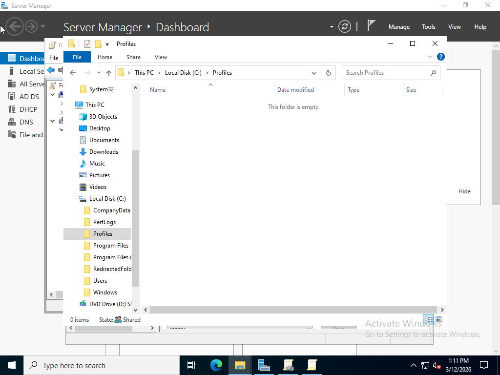
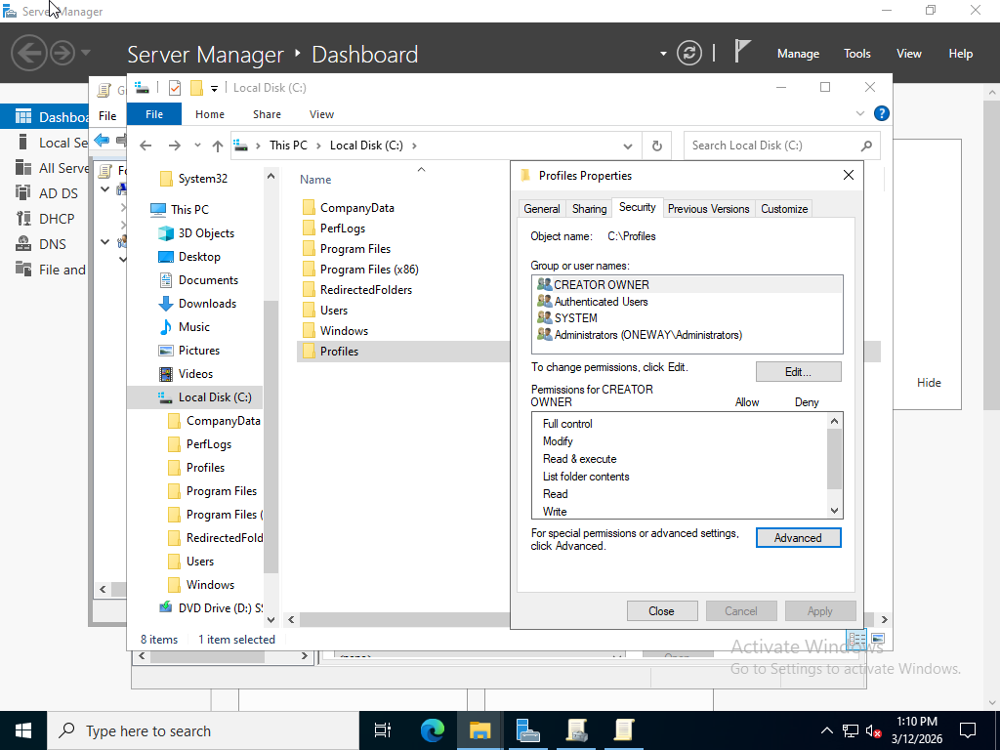
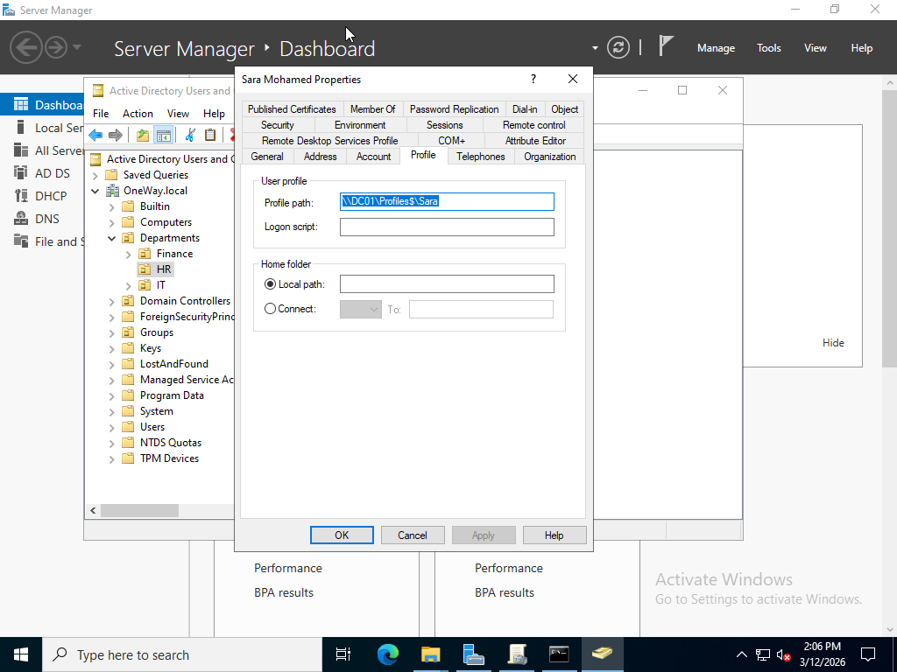
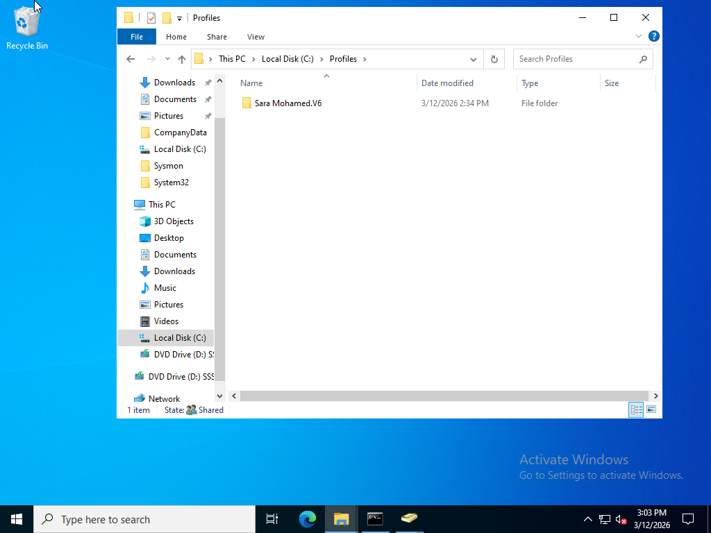
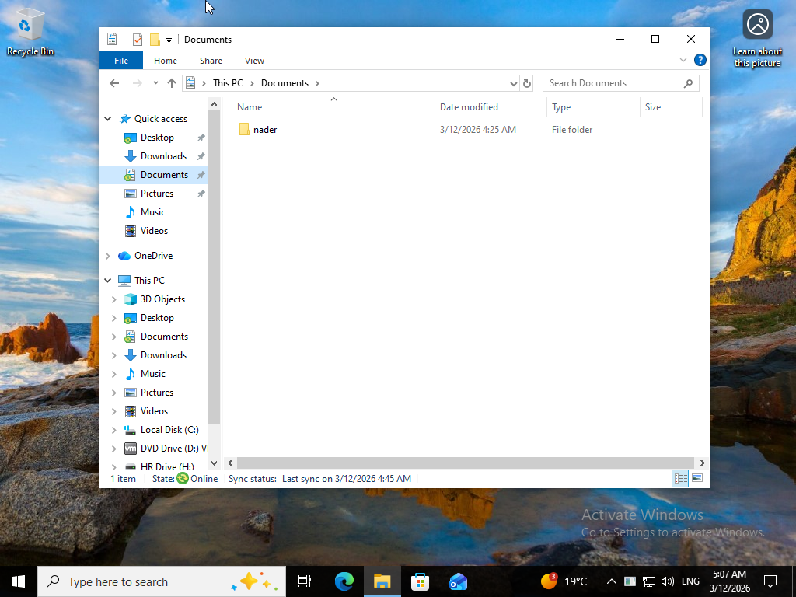

# Roaming Profiles Lab

## Overview
This lab demonstrates how to configure **Roaming Profiles** in Active Directory so that user profiles are stored on the server and synchronized across domain computers.

Environment built using:

- Windows Server 2022 (Domain Controller)
- Windows 10 Client
- VMware Workstation

---

## Lab Objectives

- Configure a shared folder for roaming profiles
- Assign profile paths to domain users
- Test profile synchronization between client and server

---

## Lab Architecture

Domain Controller: DC01  
Domain: OneWay.local  
Profile Share: \\DC01\Profiles$

---

## Configuration Steps

### 1. Create Profiles Shared Folder
A folder named **Profiles** was created on the server and shared as:
### 2. Configure Shared Folder The folder was shared with the following path: ``` \\DC01\Profiles$ ``` 
### 3. Configure Permissions Share and NTFS permissions were configured to allow users to create and store their profile folders. 
### 4. Configure Profile Path In **Active Directory Users and Computers**, the user profile path was configured as: ``` \\DC01\Profiles$\%username% ``` --- 

## Testing 

1. The user logged in from the client computer.
2. A folder was created on the Desktop.
3. The user logged off.
4. The profile folder was automatically created on the server.
5.  he folder appeared again when logging back in. -

6.  ## Screenshots

### Profiles Shared Folder


### Share Configuration


### Profile Path Configuration


### Profile Folder Created on Server


### Client Desktop Test

